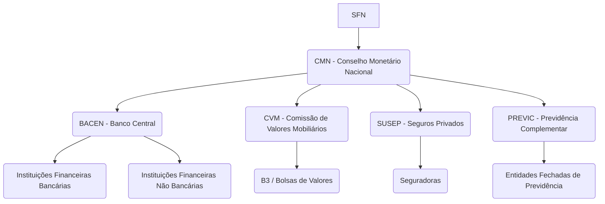

# 💰 Sistema Financeiro Nacional (SFN)

O **SFN** é o conjunto de **instituições e regulamentos** que organizam, fiscalizam e garantem o funcionamento do sistema financeiro brasileiro.  
👉 Ele movimenta e protege o dinheiro do país — **bancos, bolsas, seguradoras e previdências** fazem parte.

---

## 🎯 Funções do SFN
1. **Estabilidade Financeira** – proteger o interesse dos investidores e evitar crises.
2. **Desenvolvimento Econômico** – fomentar o crescimento, controlar a inflação e garantir circulação equilibrada de moeda.
3. **Inclusão Financeira** – ampliar o acesso da população ao sistema financeiro (ex: programas sociais e microcrédito).

---

## 🏛️ Estrutura do SFN

O CMN é o órgão máximo e normativo — cria as regras.
Os demais (BACEN, CVM, SUSEP, PREVIC) são executores e fiscalizadores.

---

# 🏦 CMN - Conselho Monetário Nacional
> **Órgão Normativo Supremo** — define as diretrizes gerais da política monetária, creditícia e cambial do Brasil.

### 👥 Composição
* **Ministro da Fazenda** → Lula que escolhe
* **Presidente do Banco Central**
* **Ministro do Planejamento e Orçamento**

### ⚙️ Principais Funções

1. Controlar o **volume de moeda** em circulação.
2. Regular o **valor da moeda** e combater a **inflação**.
3. Zelar pela **liquidez e solvência** das instituições financeiras. -- para nenhum banco quebrar e ferrar o brasil
4. Coordenar **políticas de crédito, cambial e fiscal**.
5. **Autorizar emissão de papel-moeda** (executada pelo BACEN).
6. Estabelecer **metas de inflação** e políticas macroeconômicas.

---

# 🪙 BACEN - Banco Central do Brasil

> **Órgão Executor e Fiscalizador** — braço direito do CMN.

### ⚙️ Funções Principais

1. **Executar políticas** monetárias, cambiais e de crédito definidas pelo CMN.
2. **Emitir moeda** e controlar o meio circulante.
3. **Fiscalizar instituições financeiras**.
4. **Regular o sistema de pagamentos** (como o **Pix**).
5. **Controlar reservas internacionais** e a taxa de juros básica (**Selic**).

### 🧩 Estrutura

* **Presidente do BACEN**
* **8 Diretores**

### 🆓 Autonomia do BACEN

* Tornou-se **autônomo** pela **Lei Complementar nº 179/2021**, durante o governo Bolsonaro.
* Mandato fixo e não coincidente com o do Presidente da República → maior estabilidade institucional.

---

# 📈 CVM - Comissão de Valores Mobiliários

> **Órgão Fiscalizador** do mercado de capitais (ações, fundos, bolsa).

### ⚙️ Funções

1. Implementar normas e diretrizes do mercado de valores mobiliários.
2. Fiscalizar:

   * **Corretoras** (ex: XP, Rico)
   * **Bolsas de Valores** (ex: B3)
   * **Companhias abertas** (S.A listadas)
   * **Fundos de investimento**
3. Proteger o investidor e garantir transparência no mercado.

---

# 🛡️ SUSEP - Superintendência de Seguros Privados

> **Órgão Fiscalizador** do mercado de seguros, previdência aberta e capitalização.

### ⚙️ Funções

1. Fiscalizar e controlar:

   * **Seguradoras**
   * **Entidades de previdência privada aberta**
   * **Empresas de capitalização**
   * **Resseguradoras**
2. Garantir o cumprimento das normas definidas pelo **CNSP** (Conselho Nacional de Seguros Privados).

💡 *Exemplo:*
O CNSP determina que seguros de vida devem cobrir casos de morte por COVID.
A SUSEP verifica se as seguradoras estão realmente cumprindo.

---

# 🧓 PREVIC - Superintendência Nacional de Previdência Complementar

> **Órgão Fiscalizador** das **entidades de previdência complementar fechada** (fundos de pensão).

### ⚙️ Funções

* Fiscalizar e supervisionar **fundos de previdência fechados**, geralmente vinculados a empresas.

  > Exemplo: fundo de previdência da **Deloitte**, exclusivo para colaboradores, é supervisionado pela **PREVIC**.

### 🧠 Ligação

* A **PREVIC** atua sob normas do **CNPC** (Conselho Nacional de Previdência Complementar).
  *— CNPC não costuma cair em prova.*

---

# 🧭 Resumo Geral

| Tipo de Órgão               | Instituição | Função Principal                                          | Subordinação    |
| --------------------------- | ----------- | --------------------------------------------------------- | --------------- |
| **Normativo**               | CMN         | Cria regras e diretrizes do sistema                       | Governo Federal |
| **Executor / Fiscalizador** | BACEN       | Política monetária, emissão de moeda, fiscalização de IFs | CMN             |
| **Executor / Fiscalizador** | CVM         | Fiscaliza mercado de capitais                             | CMN             |
| **Executor / Fiscalizador** | SUSEP       | Fiscaliza seguros, previdência aberta e capitalização     | CNSP            |
| **Executor / Fiscalizador** | PREVIC      | Fiscaliza previdência complementar fechada                | CNPC            |

---

> 💡 **Dica para prova CPA-20:**
> CMN **cria as normas**, os demais **executam e fiscalizam**.
> Lembrar:
>
> * **CMN = cérebro** 🧠
> * **BACEN = mãos** 🤲
> * **CVM = olhos da Bolsa** 👁️
> * **SUSEP = guarda-chuva dos seguros** ☂️
> * **PREVIC = previdência fechada** 👴

---

[🔝 Voltar ao topo](#💰-sistema-financeiro-nacional-sfn)

