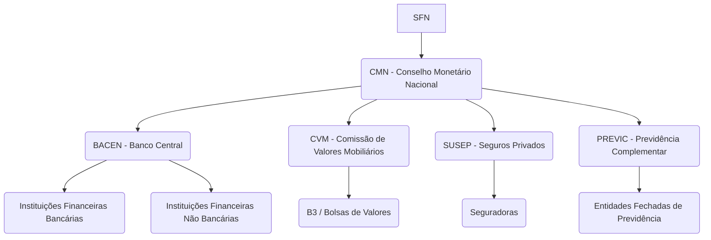

# 💰 Sistema Financeiro Nacional (SFN)

O **SFN** é o conjunto de **instituições e regulamentos** que organizam, fiscalizam e garantem o funcionamento do sistema financeiro brasileiro.  
👉 Ele movimenta e protege o dinheiro do país — **bancos, bolsas, seguradoras e previdências** fazem parte.

---

## 🎯 Funções do SFN
1. **Estabilidade Financeira** – proteger o interesse dos investidores e evitar crises.
2. **Desenvolvimento Econômico** – fomentar o crescimento, controlar a inflação e garantir circulação equilibrada de moeda.
3. **Inclusão Financeira** – ampliar o acesso da população ao sistema financeiro (ex: programas sociais e microcrédito).

---

## 🏛️ Estrutura do SFN

---

# CMN - Conselho Monetário Nacional
> Orgão Normativo - atua na criação de Normas/Leis..
É o orgão Superior - *Formula* a política da Moeda/Crédito - para Estabiliade e Desenvolvimento Econômico

## Composição
- **Ministro de Estado da Fazenda** -- Presidente do País que escolhe
- **Presidente do Banco Central** -- Formula políticas
- **Ministro de Estado e Planejamento e Orçamento** -- Define metas/estratégias

## Função do CMN
1. Adequar o Volume de meios de pagamento às necessidades de Economia -- criação do Pix, controlar moeda circulando
2. Regular o Valor da Moeda -- Inflação
3. Prezar pela liquidez das IFs -- para nenhum banco quebrar
4. Coordenar as Politicas de Crédito, dívida e fiscal
5. Autorizar Emissão de Papel Moeda -- BCB que emite
6. Defini Inflação

---

# Bacen - Banco Central
> *Fiscalizador* - Braço direito do CMN

## Função do BACEN
1. Fiscaliza as IFs
2. Coordena as políticas economicaas, fiscais e contabeis
3. Emitir moeda

## Composição
1. Presidente do BACEN;
+ 8 Diretores ()

## Autonomia do BACEN
BACEN deixou de ser vinculada ao Gov e virou autonoma lei 179/2021 -- pelo Bolsonaro

---

# CVM - Comissão de Valores Mobiliários
> *Fiscalizador* - Mercado de Valores Moboliários 

## Função do CVM
1. Implementar Diretrizes e Normas do Mercado de Valores Mobiliários
2. Fiscalizar:
   - *Corretoras* (XP, RICO...);
   - *B3*;
   - empresas *S.A* (listadas na Bolsa);
   - *Fundos de Investimento*

---

# SUSEP - Superintendencia de Seguros Privados
> *Fiscalizador*

## Função da SUSEP
1. Controle e Fiscalização do mercado de Seguro, Previdencia Privada ABERTA, Capitalização e Resseguro
2. Ficaliza:
  - Seguradoras

## CNSP
- SUSEP é ligada ao CNSP, orgao que cria as normas sobre POlítica de Seguros Privados -> SUSEP fiscaliza

*CNSP* cria uma lei falando que os seguros de vida precisam cobrir caso de morte de COVID
Quem fiscaliza se as seguradoras estão fazendo mesmo é a *SUSEP*

---

# PREVIC - Superintendencia Nacional de Previdência Complementar
> *Fiscalizador*

## Função
- Fiscalizar as entidades de Previdencia Fechadas

Exemplo.
A previdencia da Deloitte, que é exclusiva para os colaboradores da DTT, vai ser fiscalizada pela PREVIC

## CNPC -- não cai na prova
- PREVIC é ligada ao CNPC, orgão que cria as normas -> PREVIC fiscaliza
